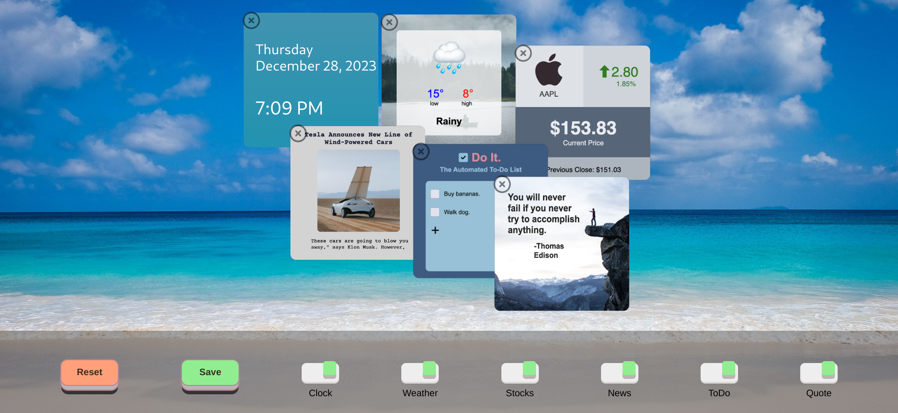
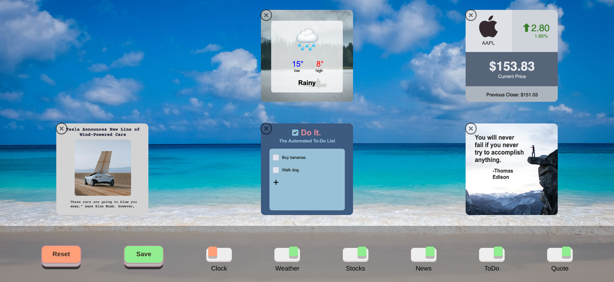

# The Best Schedule Extension

Set your schedule extension here, the best app which you can add six types of schedules. 

+ The date "Clock"
+ The weather
+ The currency "Stocks
+ The new Cars "News"
+ To-Do List
+ The best Quotes

With the green ***"Save"*** Button you can save the schedules and with the orange ***"Reset"*** Button you can reset all schedules. 


## Screenshots




With the six other buttons you can set the save and reset the schedules. 




-----

## Before you Begin 🛠 🔨

Quick start:

````
$ npm install
$ npm run dev
$ npm start
````

````
$ pnpm install
$ pnpm run dev
$ pnpm start
````

````
$ yarn install
$ yarn run dev
$ yarn start
````

Head over to https://vitejs.dev/ to learn more about using vite

--------

## Cloning the project 🪛🔨


```bash
# Clone this repository
$ git clone https://github.com/MastooraTurkmen/The-Best-Schedule-Extension.git

# Go inside the repository
$ cd The-Best-Schedule-Extension
```

------

## Languages and Tools are used 🗣️🔧

1. **Languages** 🗣️
    + [HTML](https://github.com/topics/html)
    + [HTML5](https://github.com/topics/html5)
    + [CSS](https://github.com/topics/css)
    + [CSS3](https://github.com/topics/css3)
    + [React](https://github.com/topics/react)
    + [JavaScript](https://github.com/topics/javascript)

2. **Tools** 🔧
    + [Chrome](https://github.com/topics/chrome)
    + [Figma](https://github.com/topics/figma)
    + [VSCode](https://github.com/topics/vscode)
    + [Netlify](https://github.com/topics/netlify)

------


## Deployment 📥

1. How to deploy our project to the ***Netlify*** site?

------


## React + Vite

This template provides a minimal setup to get React working in Vite with HMR and some ESLint rules.
Currently, two official plugins are available:

- [@vitejs/plugin-react](https://github.com/vitejs/vite-plugin-react/blob/main/packages/plugin-react/README.md) uses [Babel](https://babeljs.io/) for Fast Refresh
- [@vitejs/plugin-react-swc](https://github.com/vitejs/vite-plugin-react-swc) uses [SWC](https://swc.rs/) for Fast Refresh


-----


## Author 👩🏻‍💻 

**Mastoora Turkmen** 

[LinkedIn](https://www.linkedin.com/in/mastoora-turkmen/) 
<br>
[Github](https://github.com/MastooraTurkmen/)
<br>
[Twitter](https://twitter.com/MastooraJ22)